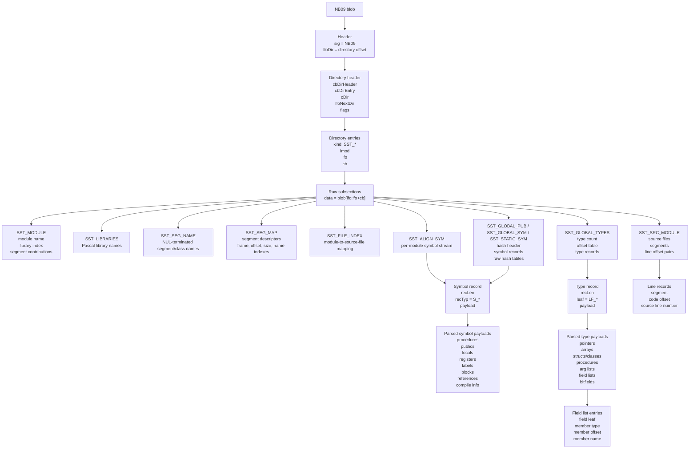

# nb09

Package `nb09` parses NB09 CodeView debug databases into Go structs used by the
disassembler.

NB09 is an older Microsoft CodeView container format. It stores debugging
metadata separately from the executable code: module names, source files,
segment maps, procedure symbols, local variables, public symbols, type records,
and source line mappings. The disassembler can use that metadata to put names,
types, scopes, and source locations back onto otherwise raw 16-bit code.

## CodeView Data

CodeView data is organized as tagged binary records. The NB09 container first
points to a directory, and the directory points to typed subsections. Each
subsection has a kind (`SST_*`), an optional module index (`imod`), a byte
offset, and a byte count.

This package currently decodes these subsection families:

- `SST_MODULE`: object/module identity, debug style, and segment contributions.
- `SST_LIBRARIES`: library names referenced by the linked program.
- `SST_SEG_NAME`: segment and class name string table.
- `SST_SEG_MAP`: logical segment descriptors, including flags, frame, offsets,
  sizes, and string-table indexes.
- `SST_FILE_INDEX`: source file names and the mapping from module index to files.
- `SST_ALIGN_SYM`: per-module CodeView symbol streams.
- `SST_GLOBAL_PUB`, `SST_GLOBAL_SYM`, `SST_STATIC_SYM`: hashed symbol streams
  plus raw symbol and address hash tables.
- `SST_GLOBAL_TYPES`: CodeView type stream beginning at type index `0x1000`.
- `SST_SRC_MODULE`: source files, segment tables, and offset-to-line mappings.

Symbol streams are made of length-prefixed records. The record type (`S_*`)
decides how the payload is interpreted. Parsed records include procedure
symbols, public symbols, local and global data symbols, frame-relative locals,
register variables, labels, blocks, thunks, object names, compile information,
procedure references, data references, and UDT aliases.

Type streams are also length-prefixed records. Their leaf type (`LF_*`) decides
how the payload is interpreted. Parsed leaves include pointers, modifiers,
arrays, structures/classes, procedures, argument lists, field lists, bitfields,
and structure members.

## NB09 Blob Structure



At the byte level, the container looks like this:

```text
0x0000
+-----------------------------+
| NB09Header                  |
|   Sig[4] = "NB09"           |
|   LfoDir                    |
+-----------------------------+
| subsection data             |
|   order varies              |
|   directory gives offsets   |
+-----------------------------+
| DirHeader at LfoDir         |
|   CBDirHeader               |
|   CBDirEntry                |
|   CDir                      |
|   LfoNextDir                |
|   Flags                     |
+-----------------------------+
| DirEntry[CDir]              |
|   Subsection SST_*          |
|   IMod                      |
|   Lfo                       |
|   CB                        |
+-----------------------------+
```

The parser follows that layout in two phases:

1. `parseNB09` validates the header, reads every directory entry, and stores each
   referenced byte range as a `RawSubsection`.
2. It dispatches recognized subsection kinds to dedicated parsers such as
   `parseModule`, `parseSymStream`, `parseHashSymSubsection`,
   `parseTypeStream`, and `parseSrcModule`.

## Parsed Model

The top-level `NB09DB` keeps both the container bookkeeping and the decoded
metadata:

- `Header` and `Dir` preserve the NB09 signature, directory header, and entries.
- `Modules`, `AlignSym`, and `SrcModule` are keyed by CodeView module index.
- `Libraries`, `SegNames`, `SegMap`, and `FileIndex` describe the linked inputs
  and final segment layout.
- `GlobalPub`, `GlobalSym`, and `StaticSym` expose hashed symbol subsections.
- `GlobalTypes` exposes the type records used by symbol type indexes.
- `TypedefByTypind` is populated later by symbol database construction from
  parsed `S_UDT` records.

Many records retain raw payload bytes alongside parsed structs. That makes the
parser useful even when a subsection contains CodeView records this package does
not understand yet.
