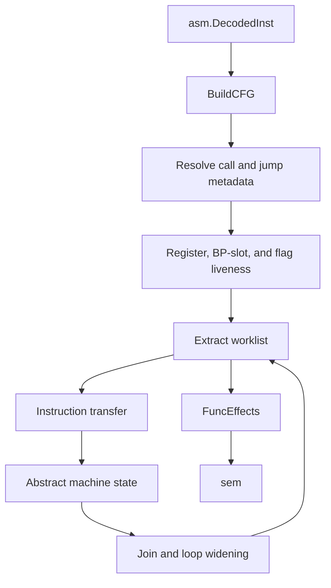
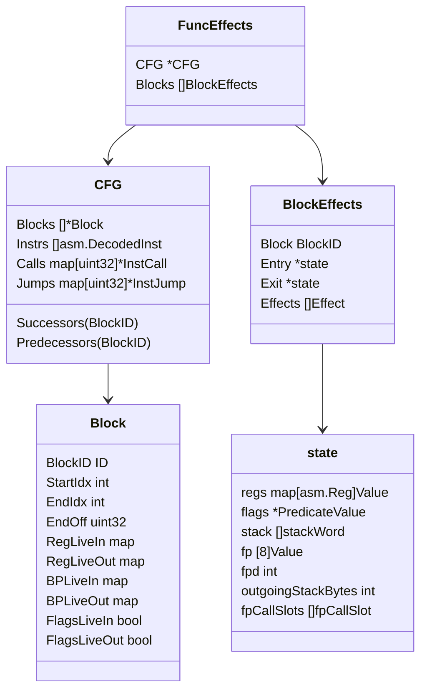
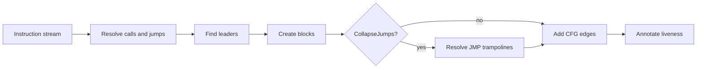
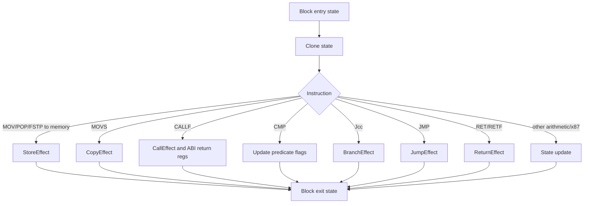
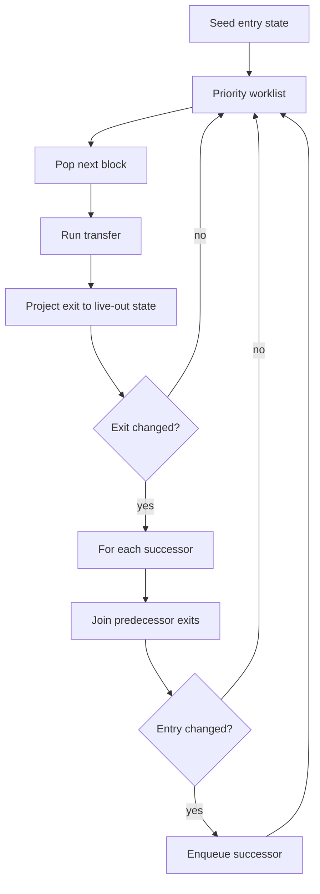

# `dasm/stars/machine`

The `machine` package is the machine-level analysis layer for a decoded Stars!
function. It takes structured 16-bit x86 instructions plus function/type
context and produces per-basic-block effects: calls, stores, branches, jumps,
and returns.

This package intentionally stops short of final C reconstruction. It preserves
machine facts as explicit values so later layers, especially `sem`, can
resolve symbols and source-level expressions without losing the uncertainty that
still exists at the instruction level.

## Pipeline



The normal caller flow is:

1. Decode produces raw `asm.DecodedInst` values.
2. `BuildCFG` stores that decoded instruction stream on `CFG.Instrs`, resolves
   call and jump metadata into CFG side tables, splits the stream into basic
   blocks, and wires predecessor/successor edges.
3. CFG liveness marks which registers, BP-relative slots, and flags are
   observable at each block boundary.
4. `Extract` walks the CFG with a worklist ordered by SCC condensation.
5. `processBlock` applies instruction transfer to an entry state clone.
6. Joins merge predecessor exit states into successor entry states.
7. Loop-carried state is widened when it keeps changing.
8. The result is `FuncEffects`, preserving each block's entry state, exit state,
   and emitted effects.

## Core Types



## Instructions And Operands

The instruction stream is plain `[]asm.DecodedInst`.

Resolved semantic metadata lives beside the instruction stream on the CFG:

- `CFG.Calls[inst.Off]` records a resolved `CALLF` target as `InstCall`.
- `CFG.Jumps[inst.Off]` records direct jump labels, target offsets, and jump
  table target offsets as `InstJump`.

This keeps the main transfer and state-machine code ergonomic while preserving
the useful call/jump metadata. Ordinary instructions no longer need a wrapper
type.

Rendering-specific annotation is outside this package. `sem` keys
operand annotations by `AnnotationKey{InstOff, Role}` and formats raw
`asm.Operand` values as locals, globals, fields, float literals, or unresolved
machine operands later.

## Control-Flow Graphs

`BuildCFG` first resolves call and jump metadata from the decoded instructions.
It treats the first instruction, jump targets, table targets, and conditional
fallthroughs as block leaders. It then splits the instruction stream into
maximal basic blocks and records sorted predecessor/successor lists.

Optional jump trampoline collapse can rewrite direct branches through simple
single-`JMP` blocks. Collapse copies the decoded instruction stream and jump
metadata, retargeting only the CFG-owned copies.



## Liveness

The extractor projects state at block boundaries. Without liveness, each join
would carry dead register history forward and loops would keep rebuilding
irrelevant expressions.

The liveness pass computes:

- `RegLiveIn` / `RegLiveOut`: full-register facts needed by later instructions.
- `BPLiveIn` / `BPLiveOut`: BP-relative stack-frame offsets that are read after
  a block boundary.
- `FlagsLiveIn` / `FlagsLiveOut`: whether condition flags cross a boundary.
- `KilledBeforeRead` and `FlagsKilledBeforeRead`: local facts that help identify
  state changes that cannot affect the block.

Byte-register reads normalize to their full register. Byte-register writes are
also modeled as needing the full parent register, because writing `AL` preserves
`AH`.

Segment registers, `BP`, and `SP` are preserved through projection because they
anchor memory, frame, and stack interpretation even when they are not ordinary
dataflow values.

## Values

`Value` is the symbolic expression language carried by machine state and
effects. Important value forms include:

- `Const`, `Scalar`, and `Unknown`.
- `Load` and `Address` for memory reads and computed addresses.
- `Binary`, `Cast`, `SignExtendValue`, `ByteValue`, and `WordValue`.
- `CallResult`, keyed by call site and target, so two calls returning the same
  type remain distinct.
- `StackWords` for multi-word ABI values before later source-level
  reconstruction.
- `PredicateValue` for condition-code based branches.
- `PhiValue` for CFG joins.

## State Transfer

`processInst` dispatches each instruction to a transfer handler. Transfer
mutates a cloned `state` and emits only source-visible machine effects.
Call and jump handling consults `CFG.Calls` and `CFG.Jumps`; all other transfer
logic switches on `asm.DecodedInst.Op`.



Examples of machine facts tracked by transfer:

- `CALLF` arguments from stack words or compiler-helper registers.
- ABI return values in `AX`, `DX:AX`, or the x87 stack.
- `CWD`, `CBW`, `IMUL`, `DIV`, and `IDIV` word relationships.
- x87 stack operations and hidden-buffer floating returns.
- `REP MOVS` copies when count is concrete, or explicit unknown effects when it
  is not.
- Stack-space windows used to stage floating-point call arguments.

## Extraction And Fixpoints

`Extract` is a block-level worklist solver. It starts from the function entry
state, processes reachable blocks, and schedules successors whenever a block's
observable exit state changes.

Blocks are ranked by `sccBlockOrder`, which topologically orders the CFG's SCC
condensation graph. This gives acyclic regions a natural forward order while
keeping loops grouped.



The solver has two convergence controls:

- Loop-aware phi widening replaces repeatedly changing loop-carried values
  with `Unknown loop`.
- Cyclic block exit widening caps repeated changes so pathological expression
  growth cannot hang extraction.

## Phi Values

State joins happen at block entries. A join reads the available predecessor exit
states, projects them to the destination block's live-in facts, and merges each
observable channel.

```mermaid
flowchart LR
    P1[Pred L_1002 exit] --> Join
    P2[Pred L_1006 exit] --> Join
    Join --> Same{Values agree?}
    Same -->|yes| Value[Keep shared value]
    Same -->|no| Phi[merge(L_1002:v1, L_1006:v2)]
    Phi --> Widen{Loop-carried and changing?}
    Widen -->|yes| Unknown[merge(..., backedge:Unknown loop)]
    Widen -->|no| Entry[Successor entry value]
    Value --> Entry
    Unknown --> Entry
```

Phi details:

- Phi arms are sorted by `BlockID.String()` order and rendered with block
  labels.
- Nested materialized phis are flattened for ordinary joins.
- Loop-carried joins preserve shape while widening so the backedge arm can be
  identified.
- Duplicate unknown arms are coalesced to keep dumps readable.
- Matching word-wise phis are recomposed arm-by-arm, so
  `words(merge(...lo...), merge(...hi...))` becomes one phi of wide values.

There is no pending-phi representation in this package. Phis are normal
`Value`s as soon as a join creates them.

## Effects

Effects are the output contract of this package:

- `StoreEffect`: write to a normalized machine memory access.
- `CopyEffect`: memory-to-memory copy such as `MOVS`.
- `CallEffect`: resolved far call, arguments, and result.
- `BranchEffect`: conditional transfer with a `PredicateValue`.
- `JumpEffect`: unconditional direct transfer.
- `ReturnEffect`: function return and optional return value.
- `UnknownEffect`: visible coverage for an instruction the machine layer cannot
  model yet.

Effects retain machine-level values. Source names, fields, indexes, and
dereferences are added later by `sem`.

## Debugging

The extractor logger carries function and current block context. `ExtractOptions`
accepts `FromAddr` and `ToAddr`; filtering is by block ID because debug dumps
and range views are block-oriented.

Useful commands while working on this package:

```sh
go run main.go dasm graph -p NthValidShdef
go run main.go dasm effects --show-color=false -n DGetDistance --asm
go test ./dasm/stars/machine
```
